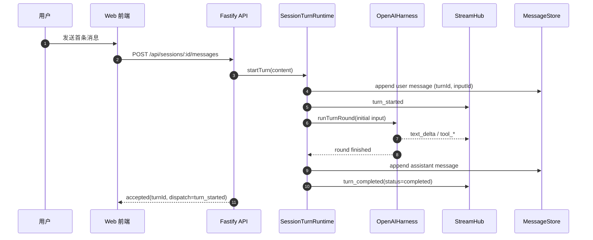
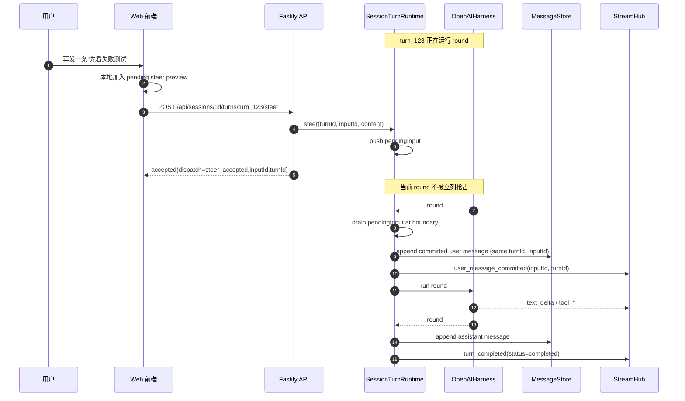
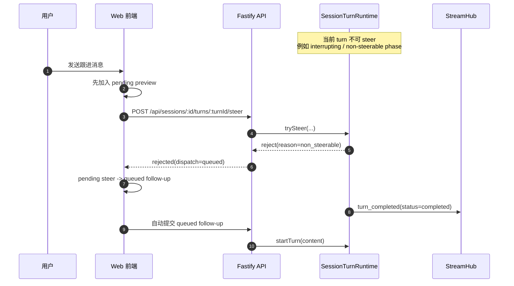
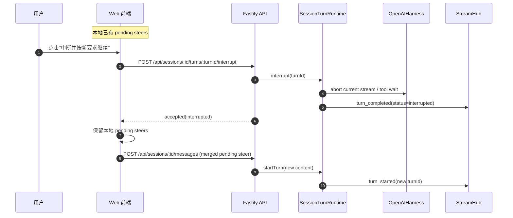

# 基于 SkillChat 复刻 Codex Mid-Turn Steering 的设计文档

## 1. 目标

本文档的目标，是在当前项目 `qizhi` / `SkillChat` 的既有架构上，复刻 Codex CLI 里“模型工作时仍可继续发消息引导”的能力，并且做到：

1. 用户在 assistant 正在流式输出、调工具、跑 skill 时，仍可继续提交新消息。
2. 新消息默认不新开一轮，而是尽可能作为当前运行中 turn 的 steer 输入。
3. steer 输入不会粗暴打断当前请求，而是在“下一个可继续边界”被吸收进同一个 turn。
4. 对于不适合 steer 的阶段，消息自动降级为“排队到下一轮”。
5. 用户可以显式中断当前 turn，并立即把待 steer 的内容作为下一轮首条消息重新提交。
6. 前端要有可见的 pending preview，不让用户误以为消息丢了。
7. 后端要有明确的 turn / active run / pending input 生命周期，而不是仅靠“按 session 串行 Promise 队列”。

本文档不是抽象讨论，而是基于当前项目的现有实现来设计：

- 后端：`apps/server/src/modules/chat/chat-service.ts`
- 流式广播：`apps/server/src/core/stream/stream-hub.ts`
- 消息存储：`apps/server/src/core/storage/message-store.ts`
- OpenAI agentic 执行：`apps/server/src/modules/chat/openai-harness.ts`
- 前端流式订阅：`apps/web/src/hooks/useSessionStream.ts`
- 前端运行态存储：`apps/web/src/stores/ui-store.ts`

## 2. 先说结论

当前项目已经具备三块可复用的基础设施：

1. `StreamHub` 已经能按 session 广播 SSE。
2. `MessageStore` 已经能把会话事件写入 `messages.jsonl`。
3. `OpenAIHarness` 本身已经是“多轮 request + 工具调用 + 继续 round”的 loop，不是一次性纯文本回复器。

真正缺的不是“流式输出”，而是下面四个概念：

1. `active turn`：当前 session 正在运行的逻辑任务。
2. `pending steer input`：运行中追加、但尚未正式提交到模型下一轮 request 的用户输入。
3. `turn lifecycle event`：`turn_started` / `user_message_committed` / `turn_completed`。
4. `frontend pending preview`：本地可见但尚未 committed 的 steer 消息区。

因此，本次复刻的核心不是改 SSE，而是给当前项目补一个 **session 级 turn runtime / actor 层**。

## 3. 当前项目的现状与问题

### 3.1 当前后端链路

当前 `ChatService.processMessage()` 的工作模式是：

1. 进入 `sessionQueues` 串行队列。
2. 立即把用户消息写入 `messages.jsonl`。
3. 立即开始后续分类 / 规划 / reply stream / harness / skill 执行。
4. 流式通过 SSE 推送 `thinking` / `text_delta` / `tool_*`。
5. 最终把 assistant 消息持久化。

这个模式的问题是：

1. 没有 `active turn` 的独立状态对象。
2. “运行中追加消息”只能排在整个 Promise 链后面，天然变成下一轮，而不是 same-turn steer。
3. 用户消息一提交就立刻持久化，这不符合 Codex 的 steer 语义。
4. 当前 SSE 里没有 `turn_started` / `turn_completed` / `pending input committed` 事件。
5. 前端只能显示 `pendingText`，不能显示“待提交 steer 消息列表”。

### 3.2 当前前端链路

当前前端是：

1. `useSessionStream()` 订阅 `/api/sessions/:id/stream`
2. `ui-store` 只维护：
   - `pendingText`
   - `transientEvents`
   - `status`
   - `lastError`
3. 页面提交消息时，如果 `sendMessageMutation.isPending`，发送按钮会被禁用。

这与 Codex 的差异非常大：

1. Codex 在运行中允许继续输入。
2. 运行中输入先进入 pending preview，不立刻当正式消息渲染。
3. committed 以后才真正写入聊天历史。

## 4. 目标能力边界

### 4.1 本文档的 MVP 范围

首版建议只做下面这些能力：

1. 只对 `regular turn` 开启 steer。
2. 基于现有 `OpenAIHarness` 路径先实现，因为它已经是 multi-round loop。
3. 对纯 `replyStream()` 的文本回复链路，先做“下一轮自动开始”，不追求和 harness 路径完全同构。
4. 不做真正的“中途抢占当前 token 流”；只做“下一个 round boundary 注入”。
5. 中断只终止当前 active turn，不自动帮用户改写提示词。

### 4.2 第二阶段再做的能力

1. review / compact / maintenance 这种非 regular turn 的 steer 拒绝与自动排队。
2. 更细粒度的 turn phase。
3. runtime snapshot 持久化到磁盘，支持进程重启恢复。
4. skill runner 中更细粒度的“可 steer / 不可 steer”边界。

## 5. 关键术语

### 5.1 Session

当前项目已有的会话概念，绑定 `messages.jsonl`、`uploads/`、`outputs/`。

### 5.2 Turn

一次逻辑任务。对用户来说是“一轮 assistant 工作”，但在内部可以包含多次 model request。

### 5.3 Turn Round

turn 内部的一次具体模型请求。一个 turn 可以包含多个 round：

1. 初始用户消息 round
2. 工具回填后的 follow-up round
3. steer 输入进入后的 continuation round

### 5.4 Pending Steer Input

用户在 turn 运行中追加的消息。它已经被前端和后端接受，但还没在历史中 committed，也还没进入下一轮模型 request。

### 5.5 Committed User Message

pending steer 被 runtime drain 后，真正写入 `messages.jsonl`，并作为当前 turn 的用户消息一部分进入 prompt。

### 5.6 Queued Follow-up Message

不能 steer，或者用户明确排队时，挂到“下一 turn”再处理的消息。

## 6. 总体架构

建议新增一个 session 级运行时协调层：

```text
API Route
  -> ChatDispatchService
    -> SessionTurnRegistry
      -> SessionTurnRuntime (per session actor)
        -> TurnRoundDriver
          -> OpenAIHarness / ModelClient / RunnerManager / ToolService
        -> StreamHub
        -> MessageStore
```

### 6.1 核心设计原则

1. **状态集中**：每个 session 同一时刻最多一个 active turn，由一个 runtime 对象托管。
2. **提交和持久化分离**：运行中提交 steer 时，先 accept，不立刻 append 到 `messages.jsonl`。
3. **边界吸收**：pending steer 只在 round boundary 被 drain。
4. **UI 本地预览，服务端权威状态**：前端展示 preview，服务端维护权威的 active turn / pending input。
5. **协议显式化**：不要再用 `done` 一把梭，需要 turn lifecycle 事件。

## 7. 时序图

### 7.1 正常开启一轮 turn



### 7.2 运行中 steer，同一 turn 吸收



### 7.3 steer 被拒绝，降级为下一轮排队



### 7.4 用户显式中断，并立即重发待 steer 内容



## 8. 后端设计

### 8.1 模块拆分建议

建议在服务端新增以下模块：

```text
apps/server/src/core/turn/
  session-turn-registry.ts
  session-turn-runtime.ts
  turn-types.ts
  turn-events.ts
  turn-persistence.ts
  turn-round-driver.ts
```

同时保留 `ChatService`，但把它降为门面层：

1. 参数校验
2. 权限校验
3. session ownership 校验
4. 调用 `SessionTurnRegistry`
5. 兼容旧 API 响应

### 8.2 运行时状态结构

建议的核心类型如下：

```ts
type TurnKind = 'regular' | 'review' | 'compact';
type TurnStatus = 'idle' | 'running' | 'interrupting' | 'completed' | 'interrupted' | 'failed';
type TurnPhase =
  | 'sampling'
  | 'tool_call'
  | 'waiting_tool_result'
  | 'streaming_assistant'
  | 'finalizing'
  | 'non_steerable';

type PendingInput = {
  inputId: string;
  content: string;
  createdAt: string;
  source: 'steer' | 'queued';
};

type ActiveTurnRuntime = {
  turnId: string;
  kind: TurnKind;
  status: TurnStatus;
  phase: TurnPhase;
  createdAt: string;
  abortController: AbortController;
  pendingInputs: PendingInput[];
  queuedNextTurnInputs: PendingInput[];
  round: number;
};
```

### 8.3 为什么不能继续使用 `sessionQueues`

当前 `sessionQueues` 的语义是：

1. 第 N 条消息必须等第 N-1 条消息整个 Promise 完成后才开始。
2. 它不知道“当前 turn 是否还能吸收 steer”。
3. 它无法在 active turn 存活期间安全接受新输入。

这意味着它适合“串行 job 队列”，不适合“可交互的长时运行 turn”。

因此要替换成：

1. `SessionTurnRegistry` 负责按 session 找到唯一 runtime。
2. `SessionTurnRuntime` 负责序列化 runtime 内部状态变更。
3. “start turn”和“steer turn”都是 runtime 命令，而不是都塞进同一个长 Promise 尾部。

### 8.4 建议的 API 设计

#### 8.4.1 保持兼容的消息入口

继续保留：

`POST /api/sessions/:id/messages`

请求体建议扩展为：

```json
{
  "content": "先看失败测试",
  "dispatch": "auto"
}
```

其中 `dispatch`：

1. `auto`：默认值。有 active regular turn 就 steer，没有就 start turn。
2. `new_turn`：强制新开一轮。
3. `queue_next`：显式排到下一轮。

响应建议改成：

```json
{
  "accepted": true,
  "dispatch": "turn_started",
  "turnId": "turn_123",
  "inputId": "input_456"
}
```

或者：

```json
{
  "accepted": true,
  "dispatch": "steer_accepted",
  "turnId": "turn_123",
  "inputId": "input_789"
}
```

#### 8.4.2 显式 steer API

为减少 race，建议额外提供：

`POST /api/sessions/:id/turns/:turnId/steer`

请求体：

```json
{
  "content": "Actually focus on failing tests first."
}
```

响应：

```json
{
  "accepted": true,
  "dispatch": "steer_accepted",
  "turnId": "turn_123",
  "inputId": "input_789"
}
```

#### 8.4.3 interrupt API

新增：

`POST /api/sessions/:id/turns/:turnId/interrupt`

响应：

```json
{
  "accepted": true,
  "turnId": "turn_123"
}
```

#### 8.4.4 runtime snapshot API

新增：

`GET /api/sessions/:id/runtime`

返回：

```json
{
  "activeTurn": {
    "turnId": "turn_123",
    "kind": "regular",
    "status": "running",
    "phase": "streaming_assistant",
    "pendingInputs": [
      {
        "inputId": "input_789",
        "content": "先看失败测试",
        "createdAt": "2026-04-12T09:10:00.000Z",
        "source": "steer"
      }
    ]
  },
  "queuedNextTurnInputs": []
}
```

这个接口对浏览器刷新恢复非常重要。Codex TUI 是单进程单前端，本项目是前后端分离 Web，不能只靠本地临时状态。

### 8.5 SSE 协议扩展

当前项目只有：

- `text_delta`
- `thinking`
- `tool_start`
- `tool_progress`
- `tool_result`
- `file_ready`
- `done`
- `error`

为了复刻 Codex，需要扩展为：

```ts
export const SSE_EVENT_NAMES = [
  'turn_started',
  'turn_status',
  'user_message_committed',
  'text_delta',
  'thinking',
  'tool_start',
  'tool_progress',
  'tool_result',
  'file_ready',
  'turn_completed',
  'done',
  'error',
] as const;
```

推荐语义：

1. `turn_started`
   - `{ turnId, kind, status: 'running' }`
2. `turn_status`
   - `{ turnId, phase, round, pendingInputCount }`
3. `user_message_committed`
   - `{ turnId, inputId, role: 'user', content }`
4. `text_delta`
   - `{ turnId, messageId, content }`
5. `turn_completed`
   - `{ turnId, status: 'completed' | 'interrupted' | 'failed' }`

`done` 可以暂时保留给旧前端，但新前端应该改用 `turn_completed`。

### 8.6 消息持久化策略

这是复刻成功与否的关键点。

#### 8.6.1 新开 turn 的首条用户消息

新开 turn 时，首条用户消息可以立即持久化，因为它已经是 committed input。

#### 8.6.2 steer 消息

运行中 steer 时：

1. 不立即 append 到 `messages.jsonl`
2. 先只进入 `ActiveTurnRuntime.pendingInputs`
3. 等 round boundary drain 时，再 append 为正式 user message

这个行为必须改变当前 `ChatService.processMessage()` 的“先写消息、再跑模型”的固定顺序。

#### 8.6.3 assistant 消息

assistant 文本仍然建议在整段完成后持久化；SSE 继续负责 delta。

#### 8.6.4 是否持久化 turn lifecycle

建议：

1. `messages.jsonl` 里的业务历史仍以 `message` / `tool_*` / `error` 为主
2. turn lifecycle 可以先只走 SSE，不强制持久化
3. 如果要支持更完整的断点恢复，再新增 `turn_event` 或 `run_status` 类型

### 8.7 让 `OpenAIHarness` 成为 same-turn steering 的执行核心

这是当前项目最适合复刻 Codex 的切入点。

原因：

1. `OpenAIHarness.run()` 已经不是一次性 stream。
2. 它内部已经有：
   - `runRound()`
   - `executeLocalToolCalls()`
   - `MAX_TOOL_ROUNDS`
3. 它天然存在多个 round boundary。

也就是说，我们不需要发明一套新的 agent loop，只需要在它现有 round 循环中插入 pending input drain 即可。

#### 8.7.1 当前 `OpenAIHarness.run()` 的简化逻辑

```ts
for round in MAX_TOOL_ROUNDS:
  roundResult = runRound(inputItems)
  if no tool calls:
    emit text deltas and return
  toolOutputs = executeLocalToolCalls(...)
  inputItems = inputItems + replayed function calls + tool outputs
```

#### 8.7.2 需要改造成

```ts
for round in MAX_TOOL_ROUNDS:
  drainCommittedPendingInputsIntoInputItemsIfNeeded()
  roundResult = runRound(inputItems, signal)

  if interrupted:
    exit turn as interrupted

  if no tool calls and no pending inputs:
    emit final text and return

  if no tool calls but has pending inputs:
    continue with same turn, next round

  toolOutputs = executeLocalToolCalls(...)
  inputItems = inputItems + replayed function calls + tool outputs

  if pending inputs exist after tool outputs:
    continue next round with same turn
```

#### 8.7.3 需要给 harness 加的能力

1. 支持 `AbortSignal`
2. 支持 `beforeNextRound()` hook
3. 支持 runtime 在每个 round 完成后读取 `pendingInputs`
4. 支持向 SSE 发 `turn_status`

### 8.8 纯文本 `replyStream()` 路径如何处理

当前 `replyInText()` 和 `replyWithChatSkill()` 仍是简单的：

```ts
for await (chunk of modelClient.replyStream(...)) {
  publish text_delta
}
persist assistant message
```

这条路径没有内建 round 概念，因此建议：

1. 第一阶段优先让开启 `OpenAIHarness` 的路径拥有 full steering 能力。
2. 对纯文本路径，只支持：
   - 运行中 accept steer
   - 当前 stream 结束后自动开启同 turn 的第二个 round
3. 具体做法：
   - stream 结束后，如果 runtime 里仍有 pendingInputs，则把它们 commit 后，再调用一次 `replyStream()`。

这样虽然没有工具 round 那么自然，但行为上仍符合 Codex 的 same-turn continuation。

### 8.9 interrupt 语义

建议遵循 Codex 的思路，而不是“服务端自动接手改写提示词”。

#### 8.9.1 服务端 interrupt 时做什么

1. 标记 turn status 为 `interrupting`
2. `abortController.abort()`
3. 停止当前模型 SSE / 工具等待
4. 发 `turn_completed(status=interrupted)`
5. 清理 active turn

#### 8.9.2 interrupt 时不做什么

1. 不自动把未 committed 的 pending steer 写进历史
2. 不自动帮用户合并提示词
3. 不自动开启下一轮

#### 8.9.3 为什么这样设计

因为这能保持语义简单：

1. committed 的才进历史
2. interrupt 只是终止当前 turn
3. “中断后怎么继续”由前端决定

这和 Codex TUI 的行为最接近：中断后，UI 根据本地 pending steers 再决定是恢复输入框，还是立刻重发。

### 8.10 runtime snapshot 与恢复

前后端分离场景下，必须考虑页面刷新：

1. 前端本地 preview 会丢
2. 但服务端可能已经 accept 了 steer，只是还没 commit

因此建议：

1. `SessionTurnRuntime` 提供可序列化 snapshot
2. 前端打开 session 页时同时获取：
   - `GET /messages`
   - `GET /runtime`
3. `runtime.activeTurn.pendingInputs` 重新渲染成 preview

MVP 可只做内存态 snapshot；如果进程重启导致 runtime 丢失，则：

1. 所有 in-progress turn 视为 interrupted
2. 前端在 runtime 为空时只显示持久化历史

## 9. 前端设计

### 9.1 `ui-store` 需要新增的状态

当前 `SessionStreamState` 过于轻。建议扩展为：

```ts
type PendingPreviewInput = {
  inputId: string;
  content: string;
  source: 'steer' | 'queued';
  createdAt: string;
};

type SessionStreamState = {
  pendingText: string;
  transientEvents: StoredEvent[];
  status: 'idle' | 'connecting' | 'open' | 'error';
  lastError: string | null;

  activeTurnId: string | null;
  activeTurnStatus: 'running' | 'interrupting' | 'completed' | 'interrupted' | 'failed' | null;
  activeTurnPhase: string | null;

  pendingSteers: PendingPreviewInput[];
  rejectedSteers: PendingPreviewInput[];
  queuedMessages: PendingPreviewInput[];
};
```

### 9.2 用户发送消息的决策树

前端发送逻辑建议改成：

1. 没有 `activeTurnId`
   - 调 `POST /messages`
   - dispatch = `turn_started`
   - 这条用户消息可以直接进正式时间线
2. 有 `activeTurnId`
   - 默认先在本地插入 `pendingSteers`
   - 调 `POST /turns/:turnId/steer`
   - 成功则等待 committed event
   - 如果被拒绝则转入 `queuedMessages`

### 9.3 为什么前端不能继续“send 时按钮直接禁用”

因为这会从交互层直接把 same-turn steering 功能掐死。要复刻 Codex，必须允许：

1. 运行中继续输入
2. 运行中继续点击发送
3. 运行中看见 pending preview

### 9.4 pending preview 的展示建议

参考 Codex，底部 composer 上方加一个 preview 区块：

1. `待在当前 turn 提交`
2. `当前 turn 结束后提交`
3. `排队消息`

对本项目可以简化为：

1. `Pending steering`
2. `Queued follow-up`

UI 提示文案建议：

- “已记录，将在当前回复的下一个继续点提交”
- “当前阶段不可插入，将在本轮结束后发送”

### 9.5 committed 匹配策略

Codex TUI 由于协议限制，用 compare key 去匹配 pending steer。

本项目不应该复用那个做法。因为我们是前后端分离 Web，最稳妥的是：

1. 每次 steer accept 时，服务端生成 `inputId`
2. 前端把 preview 也按 `inputId` 存起来
3. 服务端发 `user_message_committed(inputId, turnId, content)`
4. 前端按 `inputId` 把对应 preview 移除，并把消息正式加入时间线

这样不会出现“文本相同但其实是两次不同 steer”的匹配歧义。

### 9.6 中断交互

建议前端提供两个操作：

1. `中断`
   - 只打断当前 turn
   - 保留本地 pending steers 到输入框或 preview
2. `中断并按新要求继续`
   - 调 interrupt
   - turn 完成后自动把 pending steers 合并成一条新消息重发

### 9.7 SSE 处理逻辑

`useSessionStream()` 需要增加：

1. `turn_started`
   - 设置 `activeTurnId`
   - 设置 `activeTurnStatus=running`
2. `turn_status`
   - 更新 phase / pending count
3. `user_message_committed`
   - 从 `pendingSteers` 删除
   - 追加正式 user message 到 transient timeline 或触发消息 query 增量更新
4. `turn_completed`
   - 清空 `activeTurnId`
   - 清空 `pendingText`
   - 如有 `queuedMessages`，触发 auto-send 下一条

## 10. 共享类型与协议修改建议

### 10.1 `packages/shared/src/constants.ts`

需要扩展：

1. `SSE_EVENT_NAMES`
2. `MESSAGE_KINDS`

建议新增：

```ts
export const MESSAGE_KINDS = [
  'message',
  'thinking',
  'tool_call',
  'tool_progress',
  'tool_result',
  'file',
  'error',
  'turn_status',
] as const;
```

如果不想持久化 turn 状态，也可以先不加 `turn_status` 到消息存储类型，只加 SSE。

### 10.2 `packages/shared/src/types.ts`

建议新增：

```ts
export interface TurnStartedPayload {
  turnId: string;
  kind: 'regular' | 'review' | 'compact';
  status: 'running';
}

export interface TurnCompletedPayload {
  turnId: string;
  status: 'completed' | 'interrupted' | 'failed';
}

export interface UserMessageCommittedPayload {
  turnId: string;
  inputId: string;
  content: string;
}
```

同时建议给 `StoredEventBase` 增加可选 `turnId?: string`，便于未来把同一 turn 的消息、工具、assistant 输出聚类。

### 10.3 `packages/shared/src/schemas.ts`

需要新增：

1. `steerMessageSchema`
2. `interruptTurnSchema`
3. `runtimeSnapshotSchema`

## 11. 关键执行循环伪代码

### 11.1 startTurn

```ts
async startTurn(initialContent: string) {
  assert no active turn

  const turn = createActiveTurn()
  persistCommittedUserMessage(turn.turnId, initialContent)
  publish(turn_started)

  runTurnLoop(turn, [{ inputId, content: initialContent, committed: true }])
}
```

### 11.2 steerTurn

```ts
async steerTurn(turnId: string, content: string) {
  const turn = requireActiveTurn(turnId)
  if (!isSteerable(turn)) {
    return { accepted: false, dispatch: 'queued' }
  }

  const input = { inputId, content, committed: false }
  turn.pendingInputs.push(input)

  publish(turn_status with pendingInputCount)
  return { accepted: true, dispatch: 'steer_accepted', turnId, inputId }
}
```

### 11.3 runTurnLoop

```ts
async runTurnLoop(turn) {
  while (!turn.abortSignal.aborted) {
    const pending = drainPendingInputsIfBoundaryReached(turn)
    for (const input of pending) {
      persistCommittedUserMessage(turn.turnId, input.content, input.inputId)
      publish(user_message_committed(input))
      appendInputToConversationHistory(turn, input)
    }

    const roundResult = await driver.runRound(turn)

    if (roundResult.interrupted) {
      publish(turn_completed(interrupted))
      cleanup(turn)
      return
    }

    if (roundResult.hasToolCalls) {
      await executeTools(...)
      continue
    }

    if (turn.pendingInputs.length > 0) {
      continue
    }

    persistAssistantMessage(...)
    publish(turn_completed(completed))
    cleanup(turn)
    return
  }
}
```

## 12. 与当前文件的改造映射

### 12.1 服务端

#### `apps/server/src/modules/chat/chat-service.ts`

从“单个大而全的流程函数”拆成两层：

1. `ChatService`
   - API façade
   - 权限 / session 校验
   - start / steer / interrupt 分发
2. `SessionTurnRegistry + SessionTurnRuntime`
   - active turn 生命周期
   - pending input 管理
   - round 执行

#### `apps/server/src/modules/chat/openai-harness.ts`

需要新增：

1. `signal?: AbortSignal`
2. round boundary hook
3. 回调里带 `turnId`
4. 输出 `round finished` / `needs follow up` 的结构化结果，而不是只返回最终文本

#### `apps/server/src/core/llm/openai-responses.ts`

要支持显式 interrupt，建议把 `AbortSignal` 外置，不要只在内部自己创建 controller。即：

```ts
streamOpenAIResponsesEvents({
  ...,
  signal?: AbortSignal
})
```

#### `apps/server/src/core/storage/message-store.ts`

不需要大改，但建议加两个能力：

1. append 时允许额外 `turnId` / `inputId`
2. 可选支持增量读取某个 turn 的消息

#### `apps/server/src/app.ts`

新增路由：

1. `POST /api/sessions/:id/turns/:turnId/steer`
2. `POST /api/sessions/:id/turns/:turnId/interrupt`
3. `GET /api/sessions/:id/runtime`

同时保留旧 `POST /api/sessions/:id/messages`。

### 12.2 前端

#### `apps/web/src/stores/ui-store.ts`

新增：

1. `activeTurnId`
2. `pendingSteers`
3. `queuedMessages`
4. `turn status`
5. `commitPendingInput(inputId)`

#### `apps/web/src/hooks/useSessionStream.ts`

新增对以下事件的处理：

1. `turn_started`
2. `turn_status`
3. `user_message_committed`
4. `turn_completed`

#### `apps/web/src/App.tsx`

需要改：

1. 运行中不禁用发送按钮
2. 发送逻辑区分 `start` / `steer`
3. 渲染 pending preview 区
4. 提供 interrupt 按钮

## 13. 推荐实施顺序

### Phase 1：协议和状态骨架

1. 扩展 shared types / SSE event names
2. 增加 `activeTurnId` / `pendingSteers` 前端状态
3. 增加 runtime snapshot API

交付结果：

1. 前端能知道“当前有 active turn”
2. 前端能显示 pending preview
3. 还没 fully steer，也能先打通生命周期事件

### Phase 2：服务端 runtime actor

1. 新增 `SessionTurnRegistry`
2. 改造 `ChatService.processMessage()` 为 start/steer dispatcher
3. 接入 interrupt

交付结果：

1. 一个 session 同时只有一个 active turn
2. 运行中消息不再只是 Promise 排队

### Phase 3：OpenAIHarness same-turn continuation

1. 给 harness 加 signal
2. round boundary drain pending inputs
3. committed user message 事件

交付结果：

1. 运行中 steer 真正进入同一个 turn
2. 当前 round 结束后继续跑下一 round

### Phase 4：前端完整 UX

1. preview 区
2. interrupt + resend
3. queued follow-up 自动发送

交付结果：

1. 用户感知接近 Codex
2. pending / queued / committed 三种状态可见

## 14. 测试计划

### 14.1 服务端单元测试

1. `startTurn` 创建 active turn 并发 `turn_started`
2. `steerTurn` 在 regular running turn 中 accept
3. steer 到 non-steerable phase 被 reject
4. interrupt 后 active turn 清理
5. pending input 只在 committed 后写入 `messages.jsonl`

### 14.2 服务端集成测试

1. 首条消息 -> `turn_started` -> `text_delta` -> `turn_completed`
2. 运行中 steer -> API accepted -> 不立刻持久化 -> boundary 后 `user_message_committed`
3. interrupt -> `turn_completed(interrupted)` -> 新 turn 可重新启动
4. 页面重连后 `GET /runtime` 返回 active turn 和 pending input

### 14.3 前端测试

1. active turn 期间仍可发送
2. steer 提交后进入 preview，不立刻进入正式历史
3. `user_message_committed` 到达后 preview 消失
4. `turn_completed` 后 queued message 自动发送
5. interrupt 后 preview 保留并可重发

## 15. 风险与取舍

### 15.1 最大风险：语义不清导致重复提交

如果没有 `inputId`，前后端很容易出现：

1. preview 已发送两次
2. committed 匹配错对象
3. interrupt 后重复补发

所以 `inputId` 必须是协议一等公民。

### 15.2 第二个风险：浏览器刷新导致状态不一致

如果只有本地 preview 而没有服务端 runtime snapshot：

1. 用户刷新后看不到已 accepted 但未 committed 的 steer
2. 误以为消息丢了

因此必须增加 `GET /runtime`。

### 15.3 第三个风险：所有路径一次性改完过大

建议先以 `OpenAIHarness` 路径为核心打通，因为它天然是 multi-round，最接近 Codex 的工作方式。

## 16. 最终推荐方案

如果要在当前项目里以最小工程风险复刻 Codex 的能力，我的建议是：

1. **不要**继续以 `ChatService.sessionQueues` 作为主执行模型。
2. **新增** session 级 `SessionTurnRuntime`，让“start / steer / interrupt”都变成 runtime 命令。
3. **以 `OpenAIHarness` 为 first-class 执行引擎**，先在它的 round loop 里实现 pending steer drain。
4. **前端新增 pending preview + turn lifecycle 状态**，不要再把发送按钮和“正在运行”硬绑定。
5. **协议里加 `turnId` 和 `inputId`**，避免 Web 场景下的匹配歧义。

这是最接近 Codex 机制、同时又最适合当前项目演进路线的方案。

## 17. 附录：建议新增的文件清单

```text
apps/server/src/core/turn/session-turn-registry.ts
apps/server/src/core/turn/session-turn-runtime.ts
apps/server/src/core/turn/turn-round-driver.ts
apps/server/src/core/turn/turn-types.ts
apps/server/src/core/turn/turn-events.ts

apps/server/src/modules/chat/chat-dispatch-service.ts

apps/web/src/components/PendingInputPreview.tsx
apps/web/src/lib/turn-runtime.ts
```

## 18. 附录：建议保留兼容的旧行为

为了降低改造成本，下面两点建议先兼容保留：

1. `done` SSE 事件继续发，直到前端全面切到 `turn_completed`
2. `POST /api/sessions/:id/messages` 继续作为首选入口，内部再根据 active turn 自动分流到 start / steer

这样可以让前端逐步迁移，而不是一次性切断现有消息入口。
